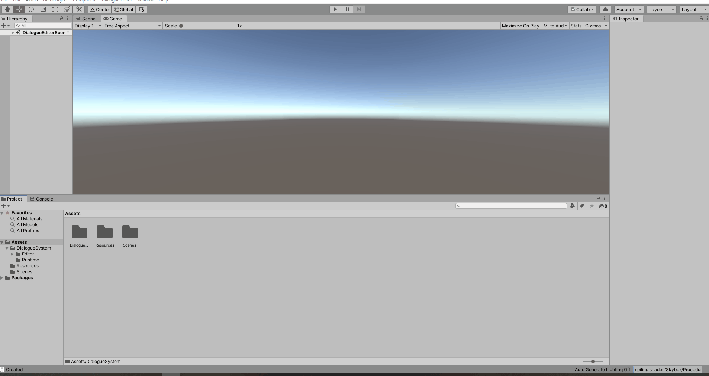

# Unity-Visual-Editor-DialogueEditor
Currently developing a visual scripting editor tool to allow users to more easily create, edit and visualize dialogue trees to be implemented within games

Each Dialogue Tree is saved as a Scriptable Object

